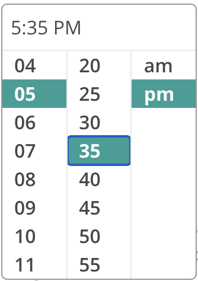
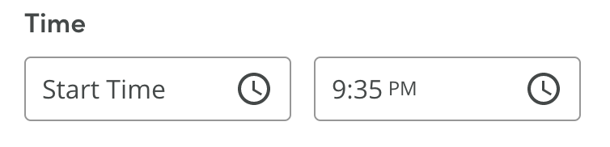

# TimePicker

This library currently uses Luxon.

Typescript friendly.

An accessible and customisable React TimePicker.

This is fork from @bonobos repo and from the repo below.
This is a simplified fork of [rc-time-picker](https://react-component.github.io/time-picker/) with the following changes:

### Styling

- uses styled components instead of less
- uses flexbox for columns instead of floating & fixed widths
- the panel now expands inline instead of popping above the content
- in collapsed state the element is now a div (instead of an input). AM/PM is separated so it can be styled independently:





### Accessibility improvements

- keyboard navigation
  - press space/enter to open or select options
  - press escape to close panel
  - change time and navigate between lists with arrow keys
- focus trap
  - focus stays within open time picker panel and doesn't get lost to background content
  - when the panel is expanded the input is focused, and focus is returned when collapsed
- uses ul/li elements with radiogroup/radio roles - so when you select hour 3 screenreader will read "3, radio, 1 of 12, Select hour, radio group".
  - This also allows for navigating between radio groups (from "Select hour" to "Select minute") in [Group mode](https://www.apple.com/voiceover/info/guide/_1133.html#vo27943).
  - `aria-checked` is used to indicate the currently selected element
- screen-reader friendly `aria-label`s with no leading zeros (so screenreader says "one" instead of "zero one"), and labels on radio groups (e.g. "Select AM or PM").
- `aria-invalid` is used to indicate incorrectly formatted time (when entering time manually)

## Usage

```js
import TimePicker from 'time-picker-io'
import ReactDOM from 'react-dom'
import styled from 'styled-components'
import { DateTime } from 'luxon'

 // You can import your own local styles based on the css base below.
import 'index.css'

// You can use styled components
const StyledTimePicker = styled(TimePicker)`  
  /* your CSS here */
`

const App = () => (
  <StyledTimePicker
    showSecond={false} // hide seconds
    use12Hours={true} // show AM/PM
    value={DateTime.local()} // show current time
    onChange={date =>
      // on change log the updated time to the console
      console.log(date.format('LTS'))
    }
    // set a custom aria-label when collapsed
    ariaLabelFunc={time => `A ${time} reminder is set, editable`}
  />
)

ReactDOM.render(<App />, container)
```

### CSS Base
- Use the css style base as a reference to you porject.
- You can either use as a reference, or copy and paste on a local file on your project.
  
  ```css
  .rc-time-picker {
    display: inline-block;
    box-sizing: border-box;
  }
  .rc-time-picker * {
    box-sizing: border-box;
  }
  .rc-time-picker-input {
    width: 100%;
    position: relative;
    display: inline-block;
    padding: 4px 7px;
    height: 28px;
    cursor: text;
    font-size: 12px;
    line-height: 1.5;
    color: #666;
    background-color: #fff;
    background-image: none;
    border: 1px solid #d9d9d9;
    border-radius: 4px;
    transition: border 0.2s cubic-bezier(0.645, 0.045, 0.355, 1), background 0.2s cubic-bezier(0.645, 0.045, 0.355, 1), box-shadow 0.2s cubic-bezier(0.645, 0.045, 0.355, 1);
  }
  .rc-time-picker-input[disabled] {
    color: #ccc;
    background: #f7f7f7;
    cursor: not-allowed;
  }
  .rc-time-picker-panel {
    z-index: 1070;
    width: 170px;
    position: absolute;
    box-sizing: border-box;
  }
  .rc-time-picker-panel * {
    box-sizing: border-box;
  }
  .rc-time-picker-panel-inner {
    display: inline-block;
    position: relative;
    outline: none;
    list-style: none;
    font-size: 12px;
    text-align: left;
    background-color: #fff;
    border-radius: 4px;
    box-shadow: 0 1px 5px #ccc;
    background-clip: padding-box;
    border: 1px solid #ccc;
    line-height: 1.5;
  }
  .rc-time-picker-panel-narrow {
    max-width: 113px;
  }
  .rc-time-picker-panel-input {
    margin: 0;
    padding: 0;
    width: 100%;
    cursor: auto;
    line-height: 1.5;
    outline: 0;
    border: 1px solid transparent;
  }
  .rc-time-picker-panel-input-wrap {
    box-sizing: border-box;
    position: relative;
    padding: 6px;
    border-bottom: 1px solid #e9e9e9;
  }
  .rc-time-picker-panel-input-invalid {
    border-color: red;
  }
  .rc-time-picker-panel-clear-btn {
    position: absolute;
    right: 6px;
    cursor: pointer;
    overflow: hidden;
    width: 20px;
    height: 20px;
    text-align: center;
    line-height: 20px;
    top: 6px;
    margin: 0;
  }
  .rc-time-picker-panel-clear-btn-icon:after {
    content: "x";
    font-size: 12px;
    font-style: normal;
    color: #aaa;
    display: inline-block;
    line-height: 1;
    width: 20px;
    transition: color 0.3s ease;
  }
  .rc-time-picker-panel-clear-btn-icon:hover:after {
    color: #666;
  }
  .rc-time-picker-panel-select {
    float: left;
    font-size: 12px;
    border: 1px solid #e9e9e9;
    border-width: 0 1px;
    margin-left: -1px;
    box-sizing: border-box;
    width: 56px;
    max-height: 144px;
    overflow-y: auto;
    position: relative;
  }
  .rc-time-picker-panel-select-active {
    overflow-y: auto;
  }
  .rc-time-picker-panel-select:first-child {
    border-left: 0;
    margin-left: 0;
  }
  .rc-time-picker-panel-select:last-child {
    border-right: 0;
  }
  .rc-time-picker-panel-select ul {
    list-style: none;
    box-sizing: border-box;
    margin: 0;
    padding: 0;
    width: 100%;
  }
  .rc-time-picker-panel-select li {
    list-style: none;
    box-sizing: content-box;
    margin: 0;
    padding: 0 0 0 16px;
    width: 100%;
    height: 24px;
    line-height: 24px;
    text-align: left;
    cursor: pointer;
    -webkit-user-select: none;
      -moz-user-select: none;
        -ms-user-select: none;
            user-select: none;
  }
  .rc-time-picker-panel-select li:hover {
    background: #edfaff;
  }
  li.rc-time-picker-panel-select-option-selected {
    background: #f7f7f7;
    font-weight: bold;
  }
  li.rc-time-picker-panel-select-option-disabled {
    color: #ccc;
  }
  li.rc-time-picker-panel-select-option-disabled:hover {
    background: transparent;
    cursor: not-allowed;
  }
  ```

### Todo
- Use Date.io as base time library.

## License

MIT
